# 2주차(2022-03-15)
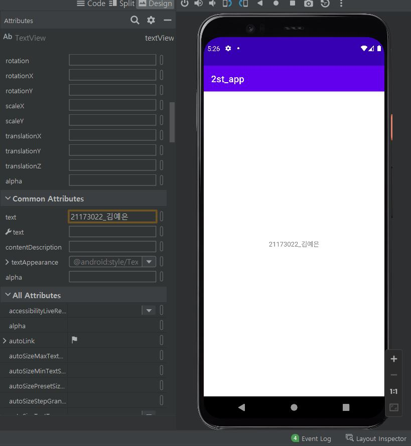 </img>

# 3주차(2022-03-22)
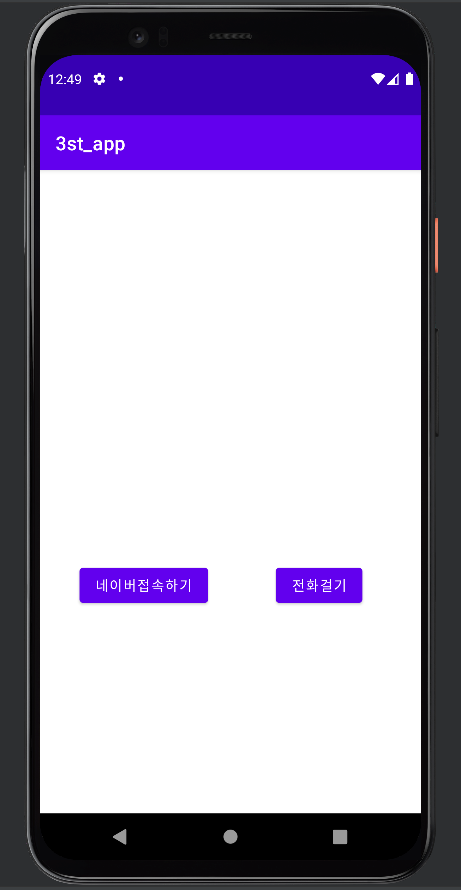 </img>
 </img>
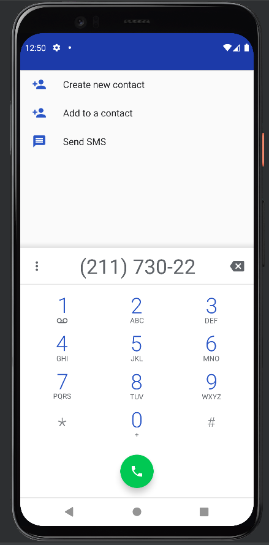 </img>

# 4주차(2022-03-29)
 </img>

# 5주차(2022-04-05)
 </img>
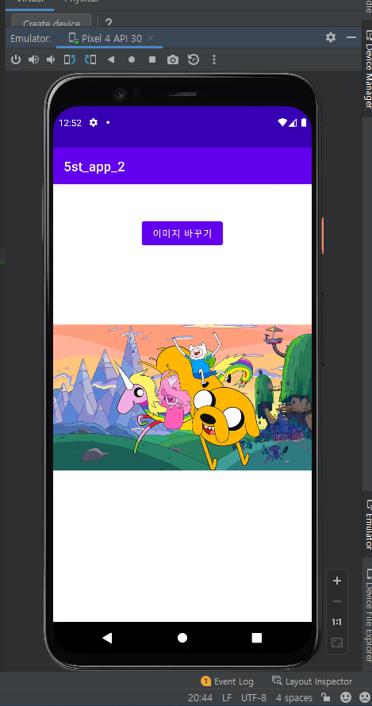 </img>
 </img>
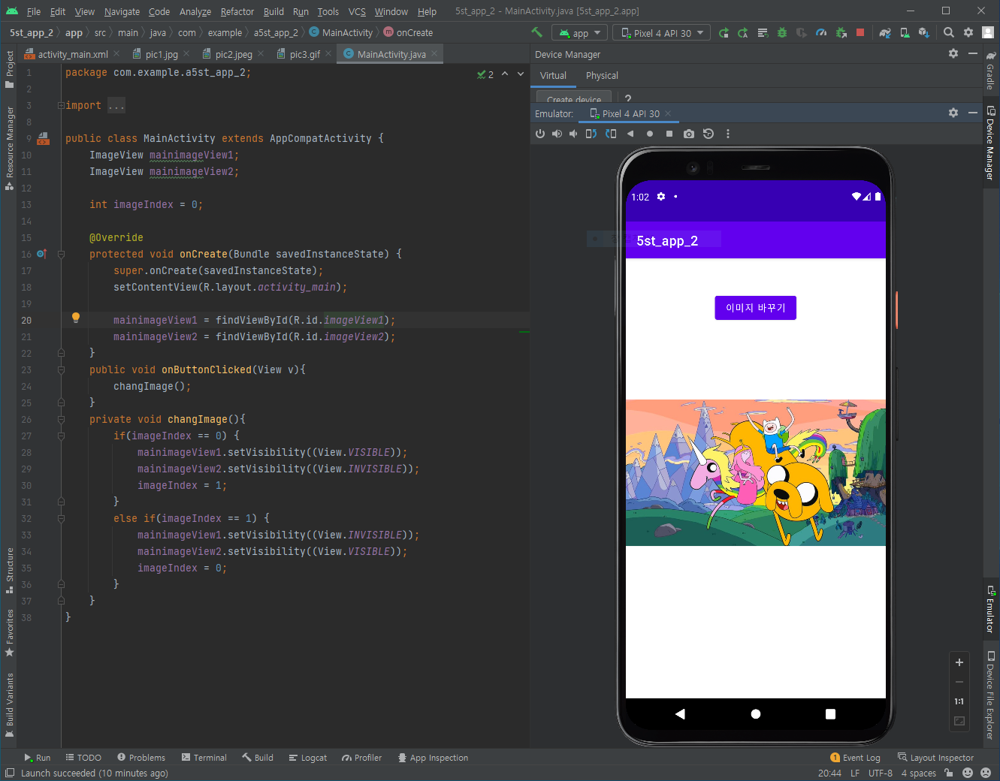 </img>

# 6주차(2022-04-18)
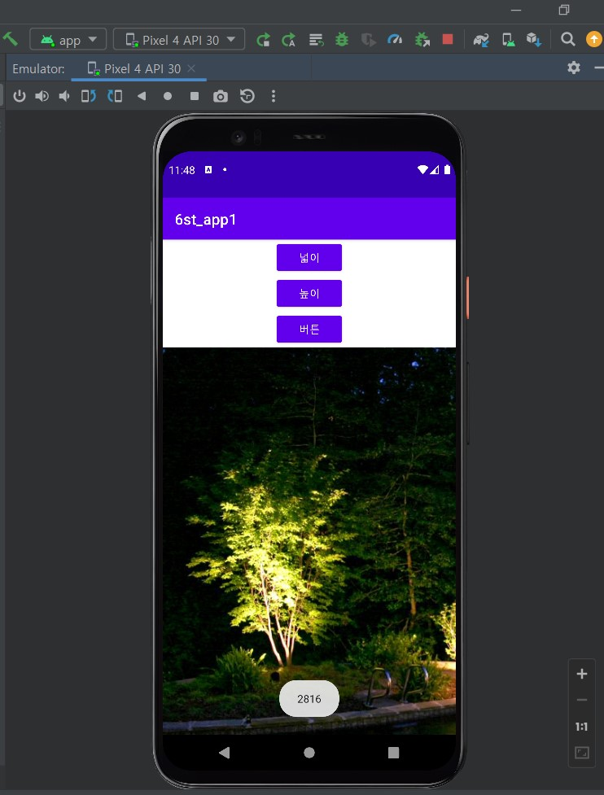 </img>
 </img>
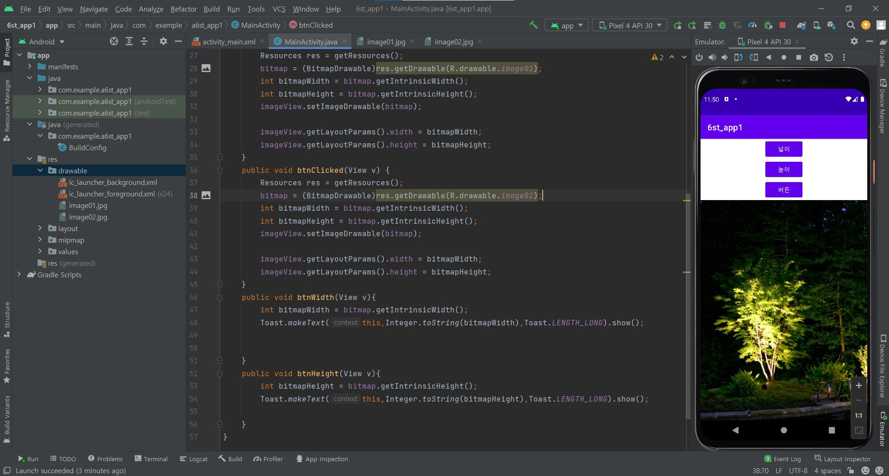 </img>

## 10주차(2022-05-10)
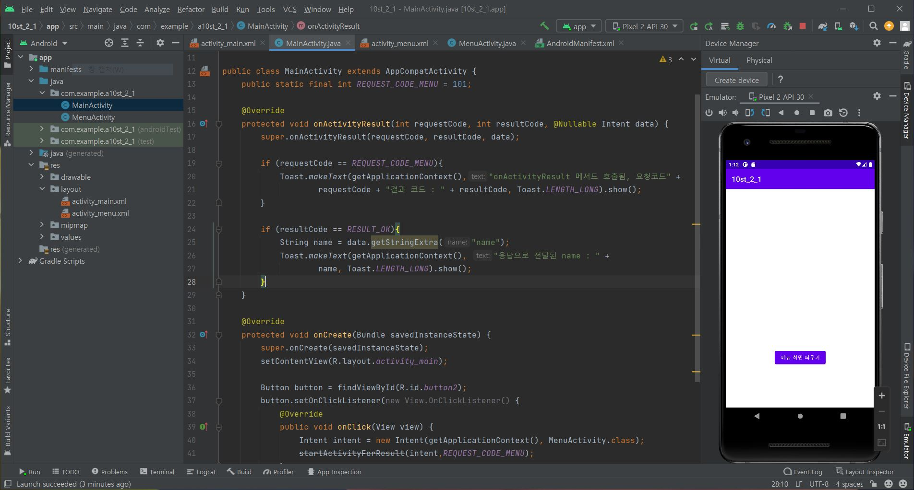 </img>
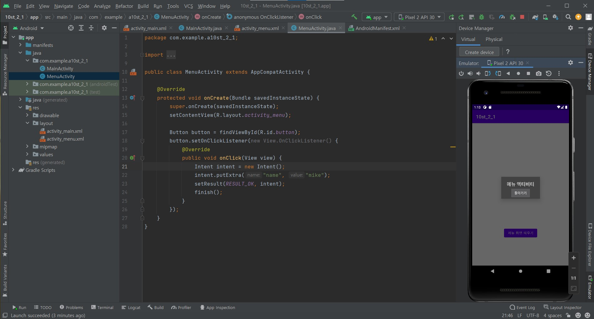 </img>

# 11주차(2022-05-17)
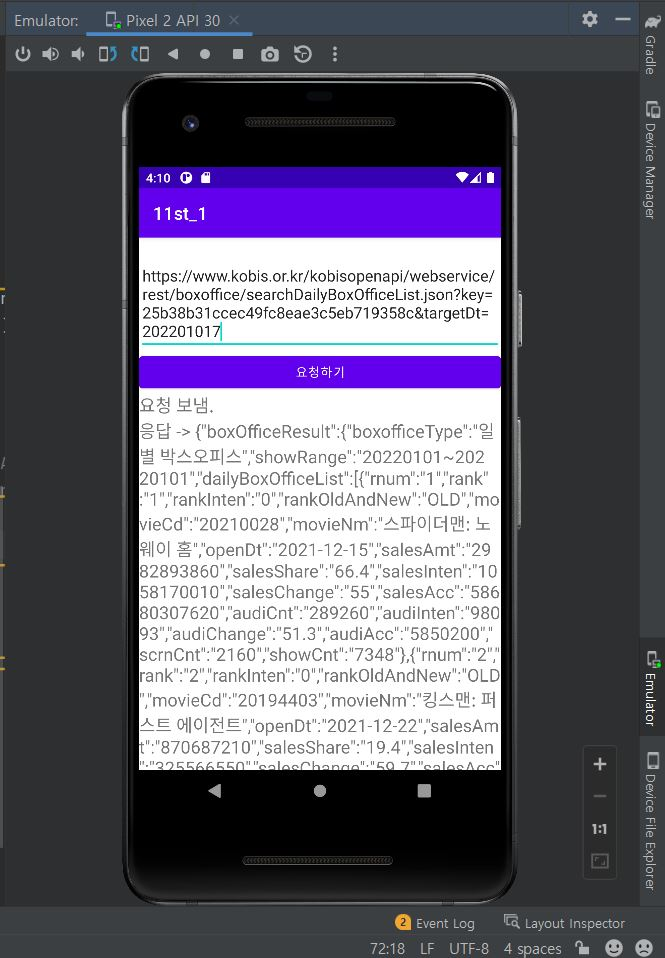 </img>
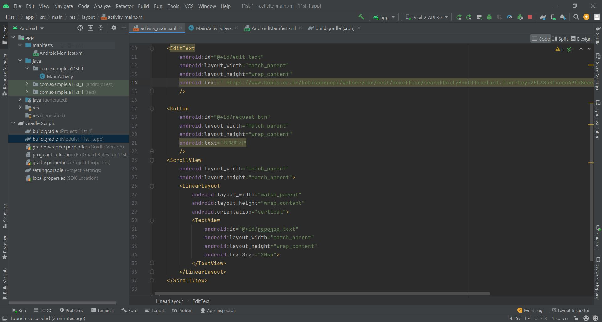 </img>
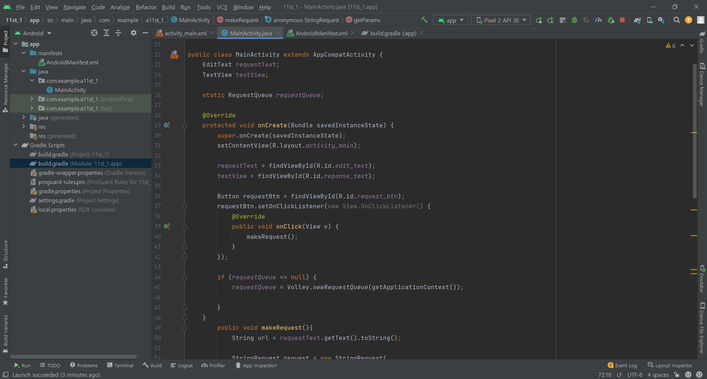 </img>
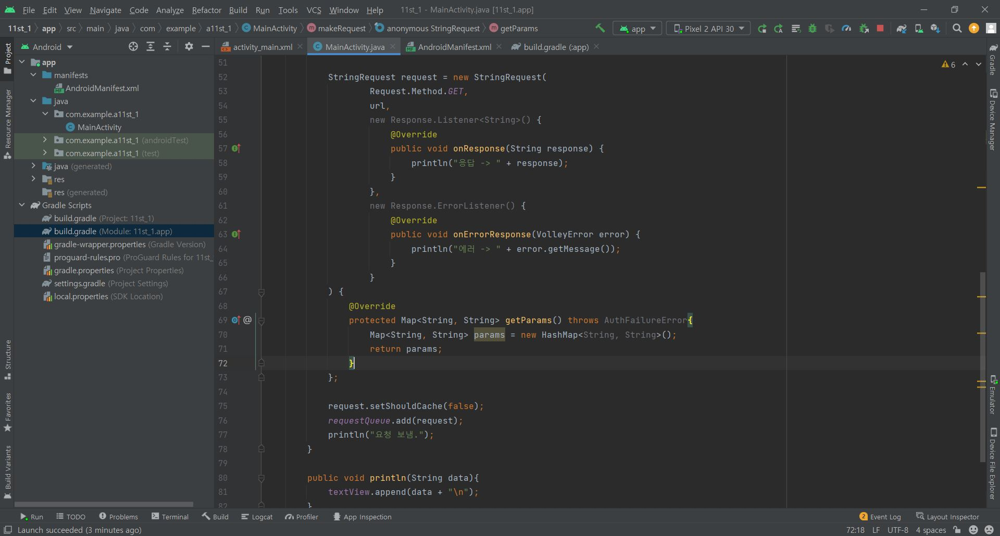 </img>
